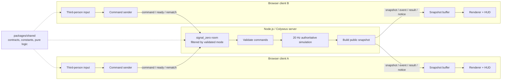
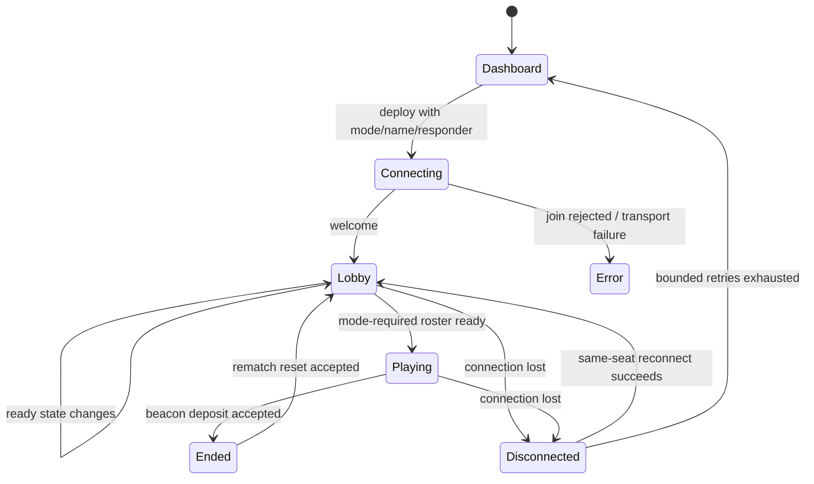
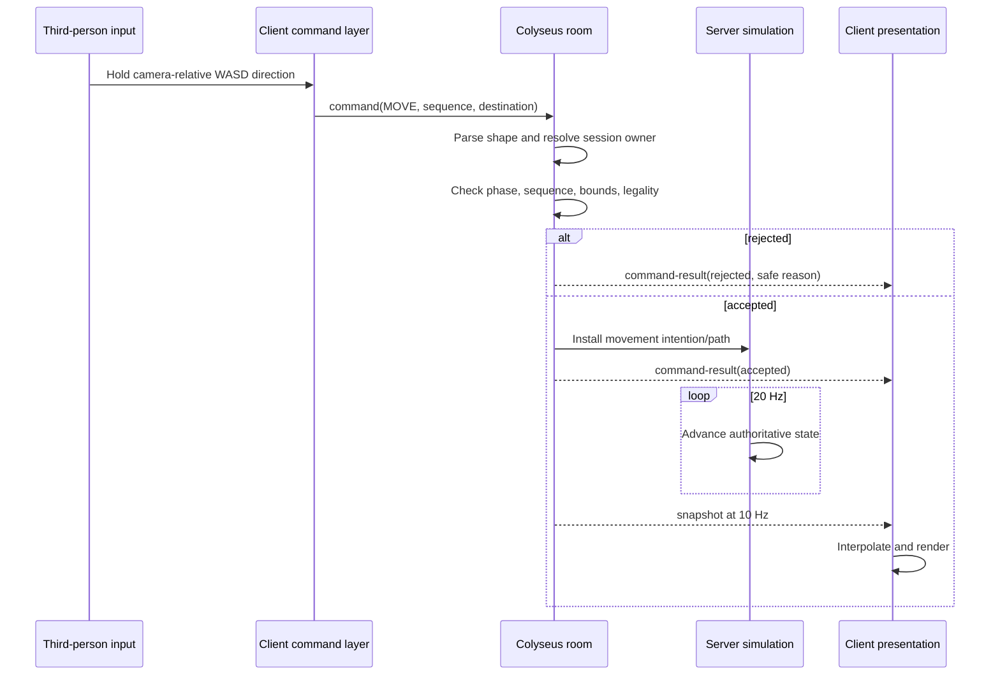

# Technical Architecture

## Status and goals

This document describes the implemented architecture for a one-player Solo Flood Drill and a two-player Versus vertical slice. The full root command suite, measured 20 Hz/10 Hz cadence, early-drop reconnection, real-SDK match loop, and complete two-browser victory/rematch flow were verified on macOS on 2026-07-16.

The architecture optimizes for four things:

1. server-authoritative competitive rules;
2. deterministic, testable path/flood behavior;
3. a smooth browser presentation despite a lower network update rate;
4. a structure a small student team can understand and extend.

It deliberately does not introduce microservices, a database, a general-purpose ECS framework, or a frontend UI framework around Three.js.

## System boundaries



Dependency direction is one-way:

```text
apps/client ─┐
             ├──> packages/shared
apps/server ─┘
```

`packages/shared` cannot depend on either app. The browser and server cannot import each other’s internals.

## Runtime processes

### Browser client

The client owns:

- the Three.js render loop, scene graph, and procedural presentation objects;
- WASD/arrow movement, orbit-camera input, interaction, and targeting state;
- loading, dashboard, connection, and lobby UI;
- transformation of an input into a typed intention;
- a short buffer of public snapshots;
- interpolation and purely cosmetic prediction/feedback;
- HUD, third-person camera, character animation, objective markers, water rendering, and transient accepted-event effects.

It does **not** own final movement, paths, damage, cast success, cooldowns, capture progress, core possession, flood propagation, respawn, or victory.

### Authoritative server

The server owns:

- Colyseus room membership, validated mode isolation, and session-to-player identity;
- team assignment, authoritative responder selection, and ready/rematch state;
- a private mutable match world;
- input validation and sequence tracking;
- fixed-step movement, combat, abilities, objectives, flood, defeat, and respawn;
- match phase/time and victory;
- construction of safe public snapshots and transient gameplay events;
- graceful cleanup when clients leave.

The prototype listens on `0.0.0.0:2567`, allowing localhost and trusted-LAN clients. Live match state stays in room memory. A persistent WebSocket-capable process will be required for deployment, but no database is needed to run a match.

### Shared package

The shared workspace is the protocol and data boundary. It contains or should contain:

- branded IDs for players/entities where useful;
- team, match-mode, match-phase, and join-option definitions;
- `MOVE`, `ATTACK_TARGET`, `ATTACK_MOVE`, `CAST_ABILITY`, `INTERACT`, `STOP`, and `HOLD_POSITION` command unions;
- runtime-safe payload parsing/validation helpers;
- four selectable responder stat definitions and the shared Rescue Line/Bayanihan Pulse data;
- map dimensions, tile size, collision/flood data, and simulation constants;
- objective and core/beacon public states;
- public snapshots and server-event/result types;
- validation-safe map/geometry helpers and constants consumed by the server A\*/flood systems.

“Shared” means shared definition, not shared authority. A client importing an attack range still cannot decide that an attack hit.

Authoritative implementations live under `apps/server/src/simulation`: `pathfinding.ts` owns A*, `flood.ts` owns flood progression/cost rules, and `GameSimulation.ts` coordinates match behavior. Shared owns the map, contracts, constants, geometry, and validation; it does not expose a second client-runnable A* or flood simulation.

## World units and map contract

- Grid width: 24 tiles
- Grid height: 14 tiles
- Tile size: 64 pixels/world units
- World extent: 1536 × 896 units
- Simulation: 20 ticks per second, one fixed step every 50 ms
- Public snapshots: 10 per second, one every two simulation ticks

All world inputs must be finite numbers inside the world. Coordinate-to-tile conversion uses a single shared policy. Collision and flood queries read the shared map data rather than Three.js geometry.

Server systems should use stable entity IDs, not array positions or display-object references. Systems that iterate entities or equal-cost path candidates need a stable order so tests and replays are understandable.

## Connection and room lifecycle

The fixed room name is `signal_zero` for both modes. A join carries a validated `mode`, display name, and responder ID. Colyseus filters matchmaking by `mode`, and the room validates the complete options again before binding its capacity and simulation: Solo Flood Drill admits one player and starts when that connected player is ready; Versus admits two players, assigns opposing teams, and starts only when both connected players are ready. A direct room-ID join with a mismatched mode is rejected server-side.

Conceptual lifecycle:



Actual phase names come from the shared match-phase type. UI strings must not become a second phase model.

On join, the server sanitizes the display name, validates the requested responder ID, creates authoritative state from that responder's shared stat profile, assigns a team, and sends `welcome`. Maya, Tomas, Kidlat, and Amihan have distinct authoritative health, energy, regeneration, movement, and basic-attack profiles plus distinct procedural client models. They intentionally share the two currently implemented abilities; a selected profile is not a claim that a unique QWER kit exists. The sending Colyseus session is the identity source for later commands; a claimed `playerId` in a payload never grants control.

On an abnormal drop, the server marks the player disconnected, stops unsafe unattended orders, drops any carried core, and reserves that exact seat for 20 seconds. The client’s bounded automatic retries allow even an early drop to reconnect; success restores connection UI and receives a fresh authoritative snapshot. This same-room flow was verified. If those retries terminate, the client returns to the dashboard instead of leaving stale match UI visible. A full page refresh does not persist a reconnection token. Room disposal clears timers and in-memory state.

## Message protocol

### Client to server

| Message   | Purpose                        | Important validation                                              |
| --------- | ------------------------------ | ----------------------------------------------------------------- |
| `ready`   | Change lobby readiness         | joined session, valid phase, boolean/action shape                 |
| `command` | Submit a gameplay intention    | schema, session owner, phase, sequence, command-specific legality |
| `rematch` | Request/vote for a clean reset | joined session, ended phase, one vote per player                  |

A command includes a discriminant, monotonically increasing sequence number, and only its required target data. Examples are a destination for `MOVE`, an entity ID for `ATTACK_TARGET`, and an ability slot plus point/target for `CAST_ABILITY`. The client estimates server time from snapshots before attaching a diagnostic timestamp, avoiding dependence on matching computer clocks. That timestamp may be checked/logged, but it never determines authoritative movement, cooldowns, or outcomes.

### Server to client

| Message          | Purpose                                            | Reliability expectation                          |
| ---------------- | -------------------------------------------------- | ------------------------------------------------ |
| `welcome`        | Session identity, team, room/bootstrap information | sent on accepted join                            |
| `snapshot`       | Compact authoritative public state                 | periodic at 10 Hz                                |
| `event`          | Transient hit/cast/defeat/capture/deposit feedback | presentation aid; snapshot remains truth         |
| `command-result` | Accepted/rejected result tied to a sequence        | lets UI clear previews and explain safe failures |
| `notice`         | Human-readable lobby/connection/match information  | not used to drive simulation                     |

The current scale can use compact full public snapshots. That is simpler to recover from than hand-written deltas and is reasonable for at most two active responder entities and a 336-cell flood grid at 10 Hz. The browser parses complete nested snapshots, events, welcome messages, and command results with shared runtime schemas before HUD/rendering code consumes them. Do not send private server fields, full path internals, validator details useful for abuse, or state every render frame. Profile serialized size before growing the entity count; deltas and interest management are later optimizations, not assumptions.

## Command flow and validation



Every handler follows the same ordered gate:

1. **Parse:** Is this a known message with the exact required fields and finite values?
2. **Authenticate:** Which player is bound to the sending session?
3. **Replay/rate protection:** Is the sequence newer and is command frequency sensible?
4. **Phase/state:** Is the match playing, and is the player alive and allowed to act?
5. **Ownership:** Does the sender control the referenced hero/object?
6. **Spatial/resource legality:** Bounds, walkability, range, line of travel/sight, target team/type, cooldown, and energy.
7. **Commit intention:** Mutate only after every required check succeeds.
8. **Respond:** Return an acknowledgement or a stable, non-sensitive rejection code.

Validation should be atomic. A rejected cast cannot spend energy, start a cooldown, move the hero, or damage an enemy.

## Fixed-step simulation

The server advances gameplay in 50 ms quanta. Render frames and socket arrival timing do not directly change simulation speed.

In Colyseus 0.17, `setSimulationInterval` must be configured before setting `patchRate = null`. Reversing that order creates a fallback clock interval that competes with the 20 Hz interval. The room keeps this ordering explicit and documented; runtime cadence was measured after the fix.

At a high level, each tick performs a stable order such as:

1. consume already-validated intentions;
2. update timers, cooldowns, and respawns;
3. advance paths/movement using current terrain cost and movement modifiers;
4. resolve attack chase/range/interval state;
5. resolve accepted ability effects;
6. update objective occupancy, capture, core, and beacon rules;
7. advance flood propagation when its fixed interval is due;
8. evaluate defeat and victory transitions;
9. emit queued transient events;
10. every second tick, build and send a public snapshot.

If implementation ordering differs, it must be documented and covered where simultaneous effects matter. For example, the team must decide whether a lethal attack on a carrier occurs before or after a same-tick deposit; array iteration order must not decide silently.

## Movement and A\* pathfinding

Movement remains destination/path based on the server; the browser never supplies trusted velocity.

1. While WASD/arrow input is held, the client sends a rate-limited normalized camera-relative `STEER` direction; release sends zero steering.
2. The server checks finite components, ownership, alive/match state, and normalizes the vector so diagonal input cannot exceed speed.
3. Every 20 Hz simulation tick applies authoritative movement speed, flood slowdown, air-control scaling, stumble/dive state, and swept axis-separated collision against the shared walkability grid.
4. `JUMP` starts server gravity only when grounded; `DIVE` applies a bounded burst plus cooldown/recovery; `GRAB` toggles only an in-range authoritative prop.
5. Legacy `MOVE`/A\* remains for explicit orders, combat chasing, tests, and possible non-player actors, but held player steering does not reinstall paths.
6. Defeat, disconnect, reset, or invalid state clears steering and releases held props.

The slice favors cardinal grid neighbours for predictable obstacle/flood behavior; if diagonal movement is introduced, corner-cut prevention and a matching heuristic require an explicit decision and tests. Equal-cost candidates need deterministic tie-breaking.

Important failure behavior:

- out-of-bounds or non-finite goals are rejected;
- blocked or unreachable goals do not teleport the hero or invent a client path;
- an empty path means “already there” only when start and goal are the same legal cell;
- path cost and movement slowdown are separate: cost influences route selection, while effective speed controls traversal time;
- if dynamic state invalidates a future waypoint, the server must stop or recalculate by a documented policy.

Attack-move uses the same movement foundation plus a server-side target-acquisition policy. `HOLD_POSITION` may acquire/attack legal targets without pursuing beyond its position rule; `STOP` clears movement and combat orders.

## Combat

An `ATTACK_TARGET` payload contains a target entity ID, not a damage claim. The server verifies that the sender controls a living attacker and that the target exists, is alive, hostile, and targetable.

If outside attack range, the server may path/chase within its configured leash/rules. Once in range and the attack interval is ready, the server applies configured damage, emits feedback, and advances the interval. An invalid, defeated, disconnected, hidden, or otherwise illegal target clears the order. Health reaching zero triggers authoritative defeat state, order cancellation, and a timed respawn at the legal team spawn.

Client hit effects follow an accepted server event or changed authoritative state. They never apply health locally.

## Rescue Line

Rescue Line intentionally crosses multiple authoritative systems:

1. `Q` creates client-only normal-cast targeting.
2. Clicking the 3D target marker sends `CAST_ABILITY` with the Q slot and target point; `Escape` sends nothing and clears the preview.
3. The server validates ownership, playing/alive state, finite target, 360-pixel range, 25 energy, six-second cooldown, and the walkable trace.
4. The full trace must remain walkable; an obstruction or invalid world position rejects the cast atomically.
5. The server determines hostile heroes crossed by the accepted segment, applies the configured prototype damage (currently 30), moves the selected responder to the safe endpoint, spends energy, starts cooldown, and grants two seconds of flood-slow immunity.
6. Snapshots/events drive the surge, hit, cooldown, energy, and immunity presentation.

The entire execution is atomic from the command’s perspective. Segment tests use server positions and stable entity ordering. Flood immunity changes the slowdown modifier only; it does not make buildings, bounds, or other collision rules disappear.

## Objective and victory state

The Weather Relay, Resilience Core, and team Beacons form a small server-side state machine:

```mermaid
stateDiagram-v2
    [*] --> Neutral
    Neutral --> CapturingA: only Team A eligible
    Neutral --> CapturingB: only Team B eligible
    CapturingA --> Contested: Team B enters
    CapturingB --> Contested: Team A enters
    Contested --> CapturingA: only Team A remains
    Contested --> CapturingB: only Team B remains
    CapturingA --> CoreAvailableA: progress completes
    CapturingB --> CoreAvailableB: progress completes
    CoreAvailableA --> CoreCarriedA: eligible Team A interaction
    CoreAvailableB --> CoreCarriedB: eligible Team B interaction
    CoreCarriedA --> CoreAvailableA: carrier defeated/disconnects; drop at position
    CoreCarriedB --> CoreAvailableB: carrier defeated/disconnects; drop at position
    CoreCarriedA --> TeamAWins: valid Team A beacon deposit
    CoreCarriedB --> TeamBWins: valid Team B beacon deposit
```



The concrete reset/decay rule when a capturer leaves belongs in shared constants/server tests. Occupancy is computed from server positions. Capture completion creates an available core at the Relay; it is not placed directly into a player inventory. Only the earning team may pick it up through a valid interaction. On carrier defeat or disconnection it drops at that authoritative position and remains restricted to the earning team. It cannot be self-awarded by a client or deposited at the opposing beacon. Victory freezes or safely terminates active gameplay orders, publishes the winner, and enters the ended phase. Rematch resets heroes, timers, paths, attacks, cooldowns, objective state, core ownership, flood grid, sequence/session match state as appropriate, and victory state without leaking state from the previous round.

## Deterministic flood model

The flood is a discrete cellular system, not client particles and not continuous fluid dynamics.

Each flood update should conceptually:

1. read an immutable view of current water levels;
2. maintain/apply configured source pressure;
3. inspect legal neighbouring cells in a fixed order;
4. calculate candidate spread using elevation/flood resistance and maximum level;
5. write results into a separate next-state buffer;
6. commit the whole buffer at once.

Double buffering prevents an iteration order from letting water cross multiple cells in one update. The same map, initial grid, tick sequence, and rules should produce byte-equivalent public levels.

Flood thresholds affect two systems:

- **Path selection:** water adds a non-negative A\* traversal penalty, so a longer dry route can become cheaper than a direct flooded street.
- **Movement:** standing/traversing in relevant water applies an authoritative speed multiplier unless a specific server-owned effect, such as Rescue Line’s two-second immunity, overrides the slowdown.

Impassable buildings never become walkable because they contain a water level. Future pumps, drains, barriers, debris, and electricity should modify inputs/rules through focused flood/infrastructure systems rather than special cases in rendering code.

## Snapshot synchronization and rendering

A public snapshot needs enough information to reproduce important visible state, for example:

- server tick/sequence and match time/phase;
- public players/heroes: ID, team, position, health/energy, alive/respawn state, current public order/target where useful;
- ability cooldown/public status;
- Relay state/progress/owner;
- core carrier and beacon/victory state;
- public flood levels or a compact equivalent;
- connection/readiness information required by the UI.

The client stores recent ordered snapshots and renders between two known authoritative positions when possible. At 10 Hz, that hides 100 ms positional steps while Three.js renders near display refresh rate. Extrapolation, if used at all, must be short and bounded. Late/out-of-order snapshots cannot rewind accepted newer state.

Local destination and targeting indicators may appear immediately because they are explicitly provisional. If `command-result` rejects the intention or a snapshot disagrees, the presentation clears/corrects without arguing with the server. Remote heroes are never simulated from local input.

Transient `event` messages improve effects but are not the only record of truth: a missed hit event must still be corrected by the next health snapshot.

## Configuration and LAN topology

Development defaults:

- Vite client: `0.0.0.0:5174`/browser port 5174
- Colyseus WebSocket server: `0.0.0.0:2567`
- Room: `signal_zero`, with matchmaking filtered by the validated `mode` join option

The Colyseus client is configured with an HTTP(S) endpoint; its SDK performs the WebSocket upgrade. Without an override, the client derives `http(s)://<window.location.hostname>:2567`. This means a teammate opening `http://192.168.x.x:5174` also targets `http://192.168.x.x:2567`, which upgrades to `ws://192.168.x.x:2567`. `VITE_SERVER_URL` exists for an explicit endpoint override, but it is public configuration, not a secret.

Vite reads the repository-root `.env` because its config sets `envDir` to the monorepo root. The server entrypoint checks for that optional file and loads it automatically with Node’s built-in `loadEnvFile`, so both dev and built start paths share the root configuration without shell-specific syntax. Server configuration prefers `SERVER_HOST`/`SERVER_PORT`, then falls back to standard `HOST`/`PORT`, and finally to `0.0.0.0:2567`. The example leaves `VITE_SERVER_URL` commented so page-host derivation works for localhost and LAN; an explicit override must use the reachable host endpoint.

Local HTTP/WS is acceptable only on a trusted LAN. Production requires HTTPS/WSS, a persistent WebSocket-capable host, origin/rate restrictions, environment-specific configuration, and operational logging.

## Security and abuse boundaries

This vertical slice is not a complete anti-cheat platform, but its trust boundary must be correct from the first commit:

- bind authority to the socket session;
- parse every message at runtime and reject extra/invalid variants consistently;
- reject non-finite coordinates and unreasonable strings/sizes;
- track command sequences and apply simple rate limits;
- never use a client clock for cooldowns or movement distance;
- never accept target/team/ownership claims without lookup;
- expose safe rejection codes, not sensitive internals or stack traces;
- avoid logging secrets or unbounded user-controlled text;
- terminate/clean timers on room disposal;
- treat environment variables bundled by Vite as public.

Authentication, accounts, matchmaking, encryption termination, distributed denial-of-service controls, moderation, and production telemetry are outside this local slice.

## Testing architecture

Pure deterministic logic should be tested without starting a browser or WebSocket server. Room/command tests should exercise the authoritative boundary with malicious as well as ordinary inputs. End-to-end manual tests then prove integration and presentation.

High-risk automated suites include:

- A\* obstacles, unreachable states, deterministic ties, and flood-weighted route choice;
- flood double-buffer determinism, resistance/elevation, maximum levels, and thresholds;
- command schema, sequence replay, session ownership, phase/range/resource/cooldown rejection;
- fixed-room mode filtering, Solo/Versus capacity and readiness, mode-mismatch rejection, and responder-ID/stat selection;
- attack/chase/defeat/respawn timing;
- Rescue Line obstruction, safe endpoint, crossed enemies, atomic cost/cooldown, and immunity;
- Relay contest/capture, restricted core spawn/pickup/drop, legal deposit, victory, and complete rematch reset;
- snapshot serialization and absence of private fields.

The root `README.md` lists the commands and live verification status.

## Extension points

Future work should extend these seams rather than bypass them:

- **New hero:** shared data definition → server behavior/system → client presentation → tests.
- **New ability/casting mode:** shared discriminated payload → server validator/executor → client targeting adapter.
- **New objective:** server state machine with a public projection, not client overlap callbacks.
- **Infrastructure/flood tool:** a tested modifier to resistance/source/drain/path rules.
- **2v2:** raise room/team capacity and audit target/team loops, snapshots, bandwidth, spawn logic, UI, and disconnect rules.
- **Production hosting:** keep simulation process-resident with WSS; add health/observability and deployment configuration without moving match truth into a database.

## Known architecture limitations

- Runtime behavior is locally verified; serialized snapshot size and long-match memory still need profiling.
- Compact full snapshots are a slice choice, not a promise that they scale to the competition entity count.
- Brief same-room reconnection is implemented and verified, and terminal retry failure returns to the dashboard; full-page token persistence, replacement players after abandonment, and multi-process handoff are not implemented.
- Four authoritative stat profiles and distinct procedural models are selectable, but all four still share Rescue Line and Bayanihan Pulse; unique responder kits are future content.
- The flood model is intentionally discrete and small; richer infrastructure interactions need explicit deterministic rules.
- The exact simultaneous-event ordering needs playtest-driven decisions for core drop/deposit and 2v2 interactions.
- Client interpolation quality under realistic latency, jitter, and packet loss remains to be measured.
